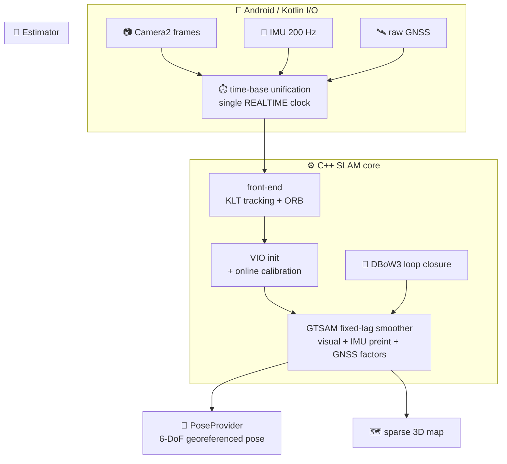

<div align="center">

# 🛰️ ODYX

### On-device Visual-Inertial SLAM with GNSS fusion. Your own localization core, no ARCore.

ODYX turns a phone's camera, IMU, and raw GNSS into a globally-georeferenced, drift-corrected 6-DoF pose and a live 3D map, computed entirely on the device.


<br/>


[**🏗️ Build guide**](docs/BUILD.md) | [**🧭 Architecture**](#-how-it-works) | [**🛰️ GNSS modes**](#-gnss-fusion-two-modes) | [**⚠️ Status**](#-status-and-honest-scope)

</div>

---

## 🚀 Why ODYX?

Most Android apps that need a camera pose just call **ARCore** and stop there. ODYX does not. It is a from-scratch **visual-inertial SLAM** core that computes pose itself from **raw** sensor streams, so you own the whole localization stack, can fuse **GNSS** for a global frame, and run on devices ARCore does not support.

It exposes a clean `PoseProvider` interface, so other apps drop ODYX in **instead of ARCore** for georeferenced pose.

> 🟢 **Built and verified on a real phone.** GTSAM, Boost, OpenCV, DBoW3, and RTKLIB are cross-compiled into a single `libodyx.so`. The capture, time-sync, and front-end pipeline is verified live on a Samsung Galaxy A17 (arm64, Android 13): camera on the REALTIME clock, 200 Hz IMU, raw multi-constellation GNSS, KLT tracking, ORB vocabulary loaded, no crashes.

## ✨ Highlights

| | Capability | What it means |
|---|---|---|
| 🧮 | **Factor-graph estimator** | A GTSAM fixed-lag smoother fusing visual features, IMU preintegration, and GNSS |
| 🛰️ | **GNSS fusion** | Global ENU anchoring and drift correction, in LOOSE (per-fix) or TIGHT (raw pseudorange + Doppler) modes |
| 📷 | **Raw sensors, no ARCore** | Camera2 frames, 200 Hz SensorManager IMU, and raw GnssMeasurement, fused by ODYX itself |
| 🛠️ | **Online self-calibration** | Camera-IMU time offset and extrinsics estimated live, plus rolling-shutter compensation |
| 🔁 | **Loop closure + relocalization** | DBoW3 bag-of-words with pose-graph optimization, and recovery on tracking loss |
| 🔌 | **PoseProvider API** | A drop-in georeferenced pose stream for other apps |
| 📦 | **One native lib** | GTSAM + Boost + OpenCV + DBoW3 + RTKLIB cross-compiled into `libodyx.so` |
| 🧭 | **Globally referenced** | Output is a drift-corrected 6-DoF trajectory in a real-world ENU frame |

## 🧠 How it works

Three clean layers: Kotlin sensor I/O on top, a C++ SLAM core in the middle, and the GTSAM estimator underneath.



The sensor boundary is kept clean: every stream is unified onto a single monotonic clock before it reaches the estimator. Full design, threading model, and the exact build notes are in [docs/BUILD.md](docs/BUILD.md).

## 🛰️ GNSS fusion, two modes

| Mode | How | When to use |
|---|---|---|
| **LOOSE** (default) | Per-fix GPS position factors, robustly weighted | Reliable global anchoring on any device |
| **TIGHT** (advanced) | Raw pseudorange + Doppler factors via RTKLIB | Maximum accuracy where raw GNSS is available |

Both anchor the local VIO trajectory into a global ENU frame and correct long-run drift.

## 🛠️ Build

ODYX is a native-heavy Android project. Full, reproduced steps (including the GTSAM and Boost cross-compile, the highest-risk part) are in **[docs/BUILD.md](docs/BUILD.md)**. Short version:

```bash
git clone https://github.com/Sherin-SEF-AI/ODYX-VISUAL-SLAM.git
cd ODYX-VISUAL-SLAM

# Fetch permissive-license native sources + the OpenCV SDK + ORB vocabulary:
scripts/fetch_deps.sh
scripts/fetch_deps.sh --vocab

# Cross-compile the Boost libraries GTSAM requires (not header-only):
scripts/build_boost_android.sh

# Build the APK:
./gradlew :app:assembleDebug
adb install -r app/build/outputs/apk/debug/app-debug.apk
```

Requirements: Android NDK, JDK 17, and an arm64 device with Camera2, a gyroscope, and raw GNSS support. See [device requirements](docs/BUILD.md).

## 📐 Calibration

ODYX ships default calibration templates and refines them online (camera-IMU time offset and extrinsics). An in-app Allan-variance logger writes a real IMU noise model, and a guided flow captures camera intrinsics and the GNSS lever arm. Details in [docs/BUILD.md](docs/BUILD.md).

## ⚠️ Status and honest scope

> 🔬 **Research prototype.** The capture, time-sync, and front-end pipeline runs live on real hardware with no crashes. The remaining work is **VIO tuning against real motion**: the estimator initializes with translational excitation, so static or rotation-only starts will not initialize yet.

- Graceful degradation throughout: without the ORB vocabulary, loop closure and relocalization switch off while VIO keeps running.
- Global accuracy depends on calibration quality and GNSS conditions.
- This is research and educational software, provided as is, with no warranty.

## 🧩 Tech stack

`Kotlin` · `Jetpack Compose` · `C++17` · `Android NDK` · `GTSAM` (factor graphs) · `Eigen` · `Boost` · `OpenCV` · `DBoW3` (loop closure) · `RTKLIB` (raw GNSS). Third-party components are permissively licensed; see the license inventory in [docs/BUILD.md](docs/BUILD.md).

## 👤 Author

**sherin joseph roy**
✉️ sherin.joseph2217@gmail.com
🔗 https://github.com/Sherin-SEF-AI

## 📄 License

Project code is released under the [MIT License](LICENSE). Bundled native dependencies retain their own permissive licenses.

<div align="center">

### ⭐ Star ODYX if a from-scratch, on-device SLAM core that owns its own pose is your kind of thing.

Built for localization that does not depend on a black box.

</div>
